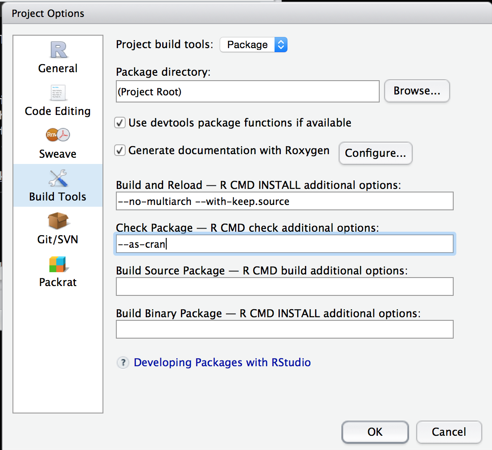
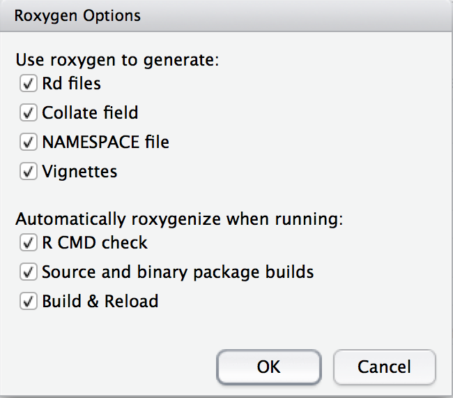

```{r setup, include=FALSE}
knitr::opts_chunk$set(echo = TRUE)
```

# What are R Packages?

## R Packages {.build}

> 1.  Sets of Functions
> 2.  Set of Functions + Documentation
> 3.  Set of Functions + Documentation + Data 
> 4.  Set of Functions + Documentation + Data + Vignettes
> 5.  Set of Functions + Documentation + Data + Vignettes + Versions
> 6.  Set of Functions + Documentation + Data + Vignettes + Versions + Dependencies


## Starting Up

Use RStudio and the `devtools` package.  It's easier.

```{r, eval = FALSE}
install.packages("devtools")
```

In RStudio, File -> New Project -> New Directory -> R Package, with a name:

- must start with letter
- no underscores
- periods allowable or use CamelCase
- can have numbers


```{r, eval = TRUE, echo = FALSE}
pkg_name = "usethis"
```

## Checking Package Names


Try the `available::available` function:

```{r, echo = TRUE, eval = FALSE}
available::available("ggplot")
```

```{r, echo = FALSE, eval = TRUE}
available::available("ggplot", browse = FALSE)
```

## Setting Up

Go to Build -> Configure Build Tools

Add `--as-cran` to "Check Package" (useful later)




## Setting Up

Documentation is a pain, but it's worthile.  Writing out argument definitions makes it easier to identify if argument names make sense.

Click Generate documents with Roxygen.  If that is gray, install `roxygen2`:

```{r, eval = FALSE}
install.packages("roxygen2")
```



Click "Configure" - click all the boxes.


## Modifying the Skeleton

Things to do:

1.  Delete `R/hello.R`
2.  Delete `man/hello.Rd`
3.  In RStudio, `Build → Configure Build Tools → Generate Documentation with Roxygen`, make sure that's clicked.  I click `Vignettes` and `Build and Reload`. 
4.  In RStudio, add `--as-cran` under the "Check options" in `Build → Configure Build Tools`.
5.  Delete the `NAMESPACE` file.  If building fails, add an empty file with `# Generated by roxygen2: do not edit by hand` at the top and rerun.


## DESCRIPTION file

In the RStudio project, go to "Go to file/function" search bar on the menu bar.
    
- This searches through the files in the package.
  - Also searches for **function names** and can go to that function in the file

Type "DESCRIPTION" and open that file.

## DESCRIPTION file

- "Title - What the Package Does (Title Case)
- "Author: YOURNAME"
- "Maintainer: YOURNAME <your@email.com>"
- "Description: Use paragraph prose here.  Don't start with word package"
    Use four spaces when indenting paragraphs within the Description.
- "License: ", one of GPL-2 GPL-3 LGPL-2 LGPL-2.1 LGPL-3 AGPL-3 Artistic-2.0
BSD_2_clause BSD_3_clause MIT

## Authors

I add this to the `DESCRIPTION` file:
```
Authors@R: person(given = "John",
           family = "Muschelli",
           role = "cre",
           email = "muschellij2@gmail.com")
```

I use `Authors@R` even if there is only one author because of the [`desc` package issue](https://github.com/r-lib/desc/issues/44) and that package is relied upon for site building and stuff later.


## DESCRIPTION file: additional fields

- Imports: package1, package2
  - packages with specific functions called in package
  - Anything other than `base` package needs to be imported (`stats`, `methods`)
- Depends: package3, package5
  - packages with **ALL** functions loaded from package
- Suggests: package4, package6
  - used in **examples** or **vignettes**
  
```r
`r pkg_name`::use_package("tidyr", type = "Imports")
`r pkg_name`::use_package("dplyr", type = "Suggests")
```


## Description

Change the `Description` so that it's a sentence and it ends with a period.  Also I keep putting single quotes around weird words (like science-specific).  Make sure to put links in angle brackets (`<http...>`).  Use DOIs if you can.  If you go too long on a line, indent it with 4 spaces `"    "`.


## Roxygen2

Roxygen allows for functions and documentation in the same file. Let's make a function:

```{r eval = FALSE}
top = function(x, n) {
  xx = x[1:n, 1:n]
  hist(xx)
  print(xx)
}
```

Save this to `top.R` file in `R/` (where R functions are).  

## Roxygen2

Highlight the following code:
```{r eval = FALSE}
top = function(x, n) {
```

Go to Code -> Insert Roxygen Skeleton

## Roxygen Skeleton:

Output:

```r
#' Title
#'
#' @param x 
#' @param n 
#'
#' @return
#' @export
#'
#' @examples
```


## Roxygen Skeleton:

You can add `@title` and `@description` tags:

```r
#' @title
#' @description
#'
#' @param x 
#' @param n 
#'
#' @return
#' @export
#'
#' @examples
```


## Roxygen Skeleton:

> - `@param` stands for a parameter/argument for that function.  
> - `@return` denotes what the function returns.  This is required.  
> - `@export` - when people install your package, can they use this function
>   - non-exported functions are usually helpers, really small, or not fully formed yet
> - `@examples` - code to show how the function works.  Wrap functions in `\dontrun{}` if not wanted to run


## Roxygen Skeleton:

```r
#' @title Print the top of a matrix
#' @description \code{top} is a small function to not just present the first rows
#' of a matrix, but also the first number of columns
#'
#' @param x a \code{matrix}
#' @param n Number of rows and columns to display of the matrix
#'
#' @return A \code{NULL}
#' @export
#'
#' @examples 
#' mat = matrix(rnorm(100), nrow = 10)
#' top(mat, n = 4)
#' \dontrun{
#'    top(mat, n = 10)
#' }
```


## Functions: a little style

1. Create a file for each function (preference) or at least group.  Name file function name.
2. Optional arguments: Set to `NULL` and use `is.null()` to test
3. Put functions together: use `#' @rdname`.
4. See `#' @inheritParams` for different functions with the same arguments.
5. Add `verbose` argument for printing
6. Use `message` (not `cat`) for printing.  Someone can use `suppressMessages` to stop the printing.
7.  Pass `...` to a main function for additional options for the user.
7. Have examples
8. Learn `do.call(FUNCTION, args = list_of_arguments)`
9. Notify/warn/message whenever you have to.


## NAMESPACE

The `NAMESPACE` files tells the R package what to import and export.  In Roxygen:

- `@export` - adds this to the NAMESPACE file
   - when package is installed, users can call this function
- `@import` - in roxygen, if you want to import a **package**, you say `@import PACKAGENAME`
   - imports **ALL** functions from that package
   - if package is listed under Depends in DESCRIPTION, then the **whole package** is loaded when you load your package
   - otherwise it simply exposes them for your package to use them, but not the user, users still have to do `library(PACKAGENAME)`

## NAMESPACE

- `@importFrom` - in roxygen, if you want to import a **function**, you say `@import PACKAGENAME func1 func2`
   - only imports these functions.  Better way of doing things.
   - if `pkgA` has function `A` and `pkgB` has functions `A` and `B`, if `@import pkgA A`,  `@import pkgB B`, then if you call `A()`, R knows it's from `pkgA`
   - you must import anything explicitly other than from the `base` package, includying anything from `stats` (e.g. `quantile`) or `graphics` (e.g. `hist`)

Add `@importFrom graphics hist` to your top.R file

## Build and Reload

- Go to Build -> Build and Reload the package
    - First time you may see some warnings (no NAMESPACE file!)
    - Rerunning should get rid of these
    - look in the folders
- Then try Build -> Check Package

## Using Data

The `data/` directory is where data goes, it **must** be named `.RData` or `rda`. The `use_data` function can do this for you:

```r
`r pkg_name`::use_data(DATAOBJECT, compress = "xz")
```

The output will be `DATAOBJECT.rda` in the `data` folder.  You can use this in your package


## Making Data

That's not reproducible!

The `data-raw` directory can be data you want to create (such as simulated data).

This will have scripts with `use_data` at the end to make the data.

```r
`r pkg_name`::usethis::use_data_raw()
```

## Documenting Data

Note how `DATAOBJECT` is the name of the object/rda.   Now we can document the data as follows:

```r
#' @title Some object to document
#'
#' @description A list containing things
#'
#' @format A list with 7 elements, which are:
#' \describe{
#' \item{x}{first thing}
#' \item{y}{second thing}
#' }
"DATAOBJECT"
```


## Different kinds of data

The `inst/` directory will copy any of the contents to the installed directory path.  So if `blah.csv` was in `inst/` then it will be in the directory. 

Most times, however, people put data in `inst/extdata` to separate folders out.

You can use `find.package` to find the installed directory:

```{r}
find.package("readr")
```

To get files, though, you should use `system.file`:

```{r}
system.file("extdata", package = "readr")
```

## Different kinds of data

If you pass in multiple characters, it assumes you put it together with `file.path`:

```{r}
system.file("extdata", "challenge.csv", package = "readr")
```

The `mustWork` argument is useful for making sure the file exists:

```{r, error=TRUE}
system.file("extdata", "asdfsdf.csv", package = "readr", mustWork = TRUE)
```


## Using the file system

1.  `file.path` > `paste` for paths
2.  Use `file.exists`.  Use `any` and `all`
3.  `file.remove` if you need to delete things
4.  Make temporary (empty, non-existent) files, with extension: `tempfile(fileext = ".csv")`.  
5. `dir.create` to create and `unlink` to destroy directories.
5.  Using `tempdir` for stuff that's intermediate.  
6.  Tempdir sub-directory: `tdir = tempfile(); dir.create(tdir); on.exit({ unlink(tdir) })`
6. `file.copy` and `file.rename`
7. `download.file` or `httr::GET`.


## Unit tests

The `testthat` package is great for unit testing.  Put test scripts in `tests/testthat`, always named `test-DESCRIPTOR.R`.  To set up `testthat`:

```r
`r pkg_name`::use_testthat()
```

And a specific test:

```r
`r pkg_name`::use_test("name of test")
```


### **General Rule: Any package issue turns into a test.**


## Unit tests

The `testthat` package is great for unit testing.  Put test scripts in `tests/testthat`, always named `test-DESCRIPTOR.R`.  To set up `testthat`:

```r
testthat::context("OVERALL DESCRIPTION OF TESTS IN THIS FILE")
testthat::test_that("Description of this test", { MYCODE })
testthat::expect_equal(OUTPUT, 1234.34535)
testthat::expect_identcal(OUTPUT1, OUTPUT2)
testthat::expect_true(SOME_OUTPUT)
testthat::expect_silent({ no_warning_error_code })
testthat::expect_message({ some_warn }, "a[test]regexp")
```


## Continuous integration (Thoughtworks.com)

> Continuous Integration (CI) is a development practice that requires developers to integrate code into a shared repository several times a day. Each check-in is then verified by an automated build, allowing teams to detect problems early.


##  Building CI and README

```r
`r pkg_name`::use_git()
`r pkg_name`::use_github() # must have GITHUB_PAT set up
`r pkg_name`::use_github(protocol = "https") # must have GITHUB_PAT set up
`r pkg_name`::use_readme_rmd()
`r pkg_name`::use_vignette("my-vignette")
`r pkg_name`::use_appveyor()
`r pkg_name`::use_travis()
```

## Configuring Travis 


In `.travis.yml`, add the following lines:

```
os:
  - linux
  - osx

warnings_are_errors: true 
after_success:
  - Rscript -e 'covr::codecov(type = "all")'
```


## Configuring Appveyor

In `appveyor.yml`, add the following lines:
```
environment:
  global:
    WARNINGS_ARE_ERRORS: 1
```


## Adding to the `README.Rmd`
 
Add the following lines, changing `GITHUB_USERNAME/REPO` to the correct version

```
[](https://travis-ci.com/GITHUB_USERNAME/REPO)
[](https://ci.appveyor.com/project/GITHUB_USERNAME/REPO)
```

or can use:

```r
`r pkg_name`::use_badge("Travis-CI Build Status", 
src = "https://travis-ci.com/GITHUB_USERNAME/REPO.svg?branch=master", 
href = "https://travis-ci.com/GITHUB_USERNAME/REPO")
```


to the `README.Rmd`. 


## S3, S4, Reference Classes

- S3 - simple - just say `class(x) = "myS3Class"`
  - Usually List of objects
  - http://adv-r.had.co.nz/S3.html
- S4 - more complex  - 
  - name, representation (slots), and inheritance (does it act like an array/list)
  - http://adv-r.had.co.nz/S4.html
- Reference Classes
  - very different, `class$method()`
  - http://adv-r.had.co.nz/R5.html
  
## S3, S4 Methods

- S3 :`bar <- function(y) UseMethod("bar", y)`
  - `bar.myS3Class` will allow you to use `bar(x)`
- S4 :`setGeneric("myGeneric", function(x) standardGeneric("myGeneric"))`
```r
setMethod("myGeneric", signature(x = "myS3Class"), function(x, y) {
 x@slot + y
})
```


## Compiled Code: C and C++

See http://r-pkgs.had.co.nz/src.html

- The `src/` folder has compiled code. 
- `cleanup` generally deletes intermediate or downloaded files run in `configure`.
- `configure` runs code before `make` is run
- `Makevars` or a `Makefile` gives direction for compiling code
- There are `configure.win` and `Makevars.win` for Windows-specific setup.
- See`.Call` for calling these compiled functions.

Using `Rcpp` is a different framework.

# Questions?


