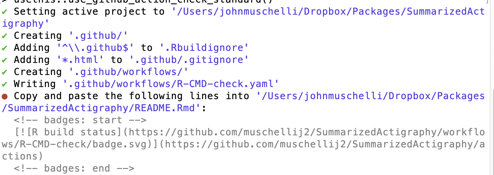

```{r setup, include=FALSE}
knitr::opts_chunk$set(echo = TRUE)
```

# What are R Packages?

## R Packages {.build}

> 1.  Sets of Functions
> 2.  Set of Functions + Documentation
> 3.  Set of Functions + Documentation + Data 
> 4.  Set of Functions + Documentation + Data + Vignettes
> 5.  Set of Functions + Documentation + Data + Vignettes + Versions
> 6.  Set of Functions + Documentation + Data + Vignettes + Versions + Dependencies

## Windows and RTools

If you have a Windows machine, you need to install RTools from https://cran.r-project.org/bin/windows/Rtools/ (choose the frozen one).  

```{r, echo = FALSE, out.width="100%"}

```

## Checking Package Names


Try the `available::available` function:

```{r available, echo = TRUE, eval = FALSE}
available::available("ggplot")
```

```{r run_avail, echo = FALSE, eval = TRUE, cache = TRUE}
available::available("ggplot", browse = FALSE)
```


## Starting Up

Use RStudio and the `devtools` and `usethis` packages.  It's easier.

```{r devtools, eval = FALSE}
install.packages(c("devtools", "usethis"))
```

In RStudio, File -> New Project -> New Directory -> R Package with devtools (scroll down), with a name:

- must start with letter
- no underscores
- periods allowable or use CamelCase
- can have numbers


```{r, eval = TRUE, echo = FALSE}
pkg_name = "usethis"
```

## Start with Git and Put on GitHub/GitLab

This is so people (including you on the cluster) can:

1. See it
2. Use it
3. Install it

```r
`r pkg_name`::use_git() # make a Git repo
`r pkg_name`::use_github() # must have GITHUB_PAT set up
`r pkg_name`::use_github(protocol = "https") # must have GITHUB_PAT set up
```

## Documentation is a pain

...but it's worthwhile.  Writing out argument definitions makes it easier to identify if argument names make sense.

```{r, echo = FALSE, out.width="32%", fig.align='center'}

```

<p style="font-size: 14pt">From https://imgflip.com/i/4mvkhl</p>


## Documentation is a pain


```{r, echo = FALSE, out.width="100%"}

```
<p style="font-size: 18pt">https://twitter.com/kcranstn/status/370914072511791104</p>


## Use Roxygen2

Go to Build -> Configure Build Tools.  Click Generate documents with Roxygen.  If that is gray, install `roxygen2`:

```{r, eval = FALSE}
install.packages("roxygen2")
```


Click "Configure" - click all the boxes.

## DESCRIPTION file

In the RStudio project, go to "Go to file/function" search bar on the menu bar.
    
- This searches through the files in the package.
  - Also searches for **function names** and can go to that function in the file

Type "DESCRIPTION" and open that file.

```{r plot, out.width="60%", echo = FALSE, fig.align='center'}

```

## DESCRIPTION file

- `Title - What the Package Does (Title Case)`
- `Authors@R: c(person("first", "last"))` - `usethis::use_author()`
  - `  comment = c(ORCID = "ORCID-ID")`
- `Description: Use paragraph prose here.  Don't start with word package`
    Use 2-4 spaces when indenting paragraphs within the Description.
- "License: ", `usethis::use_*_license`


## Authors

I add this to the `DESCRIPTION` file:
```
Authors@R: c(person(given = "John",
           family = "Muschelli",
           email = "muschellij2@gmail.com",
           role = c("aut", "cre"),
           comment = c(ORCID = "0000-0001-6469-1750")))
```

Use `Authors@R` even if there is only one author.


## License

`` `r pkg_name`::use_gpl3_license("John Muschelli") ``

- https://www.r-project.org/Licenses/

```{r, echo = FALSE, out.width="100%"}

```


## DESCRIPTION file: additional fields

- You do not use `library` or `require` in functions in a package
- Imports: package1, package2
  - packages with specific functions called in package
  - Anything other than `base` package needs to be imported (`stats`, `methods`)
  - does not expose all functions to user
- Depends: package3, package5 - **do not use other than `R(>=RVERSION)`**
  - packages with **ALL** functions loaded when call your package
- Suggests: package4, package6
  - used in **examples** or **vignettes** (check if installed)

  
```r
`r pkg_name`::use_package("tidyr", type = "Imports")
`r pkg_name`::use_package("dplyr", type = "Suggests")
```


## Description Field (in `DESCRIPTION` file)

- Change the `Description` field so that it's a sentence and it ends with a period.  
- Pu single quotes around weird words (like science-specific).  
- Make sure to put links in angle brackets (`<http...>`).  Use DOIs if you can.  
- If you go too long on a line, indent it with 4 spaces `"    "`.  

```{r, echo = FALSE, out.width="70%", fig.align="center"}

```


## Roxygen2

Roxygen allows for functions and documentation in the same file. Let's make a function:

```{r eval = FALSE}
top = function(x, n) {
  xx = x[1:n, 1:n]
  hist(xx)
  print(xx)
}
```

Save this to `top.R` file in `R/` (where R functions are).  

## Roxygen2

Highlight the code of a function definition:
```{r eval = FALSE}
top = function(x, n) {
```

Go to Code -> Insert Roxygen Skeleton

## Roxygen Skeleton Output

```r
#' Title
#'
#' @param x 
#' @param n 
#'
#' @returns
#' @export
#' @examples
```

> - `@param` stands for a parameter/argument for that function.  
> - `@returns` denotes what the function returns.  This is required.  
> - `@export` - when people install your package, can they use this function
>   - non-exported functions are usually helpers, really small, or not fully formed yet
> - `@examples` - code to show how the function works.  Wrap functions in `\dontrun{}` if not wanted to run


## Roxygen Skeleton:

You can add `@title` and `@description` tags:

```r
#' @title
#' @description
#'
#' @param x 
```
...


## Roxygen Skeleton:

```r
#' @title Print the top of a matrix
#' @description `top` is a small function to not just present the first rows
#' of a matrix, but also the first number of columns
#'
#' @param x a `matrix`
#' @param n Number of rows and columns to display of the matrix,
#' similar to [utils::head()]
#'
#' @returns The matrix that is subset based on parameters
#' @export
#'
#' @examples 
#' mat = matrix(rnorm(100), nrow = 10)
#' top(mat, n = 4)
#' \dontrun{
#'    top(mat, n = 10)
#' }
```


## Organizing Functions: a little style

1. Create a file for each function (preference) or at least group.  Name file function name.
2. Optional arguments: Set to `NULL` and use `is.null()` to test
3. Put functions together: use `#' @rdname`.
4. See `#' @inheritParams` for different functions with the same arguments.
5. Add logical `verbose` argument for printing
6. Use `message` (not `cat`) for printing.  Someone can use `suppressMessages` to stop the printing.  Wrap these with `if (verbose)`
7. Pass `...` to a main function for additional options for the user.
7. Have examples (vignette too) - `usethis::use_vignette()`
8. Learn `do.call(FUNCTION, args = list_of_arguments)`
9. Notify/warn/message whenever you have to.

# Functions are Verbs (action words)


## NAMESPACE

The `NAMESPACE` files tells the R package what to import and export.  In Roxygen:

- `@export` - adds this to the NAMESPACE file
   - when package is installed, users can call this function
- `@import` - in roxygen, if you want to import a **package**, you say `@import PACKAGENAME`
   - imports **ALL** functions from that package
   - if package is listed under Depends in DESCRIPTION, then the **whole package** is loaded when you load your package
   - otherwise it simply exposes them for your package to use them, but not the user, users still have to do `library(PACKAGENAME)`

## NAMESPACE

- `@importFrom` - in roxygen, if you want to import a **function**, you say `@import PACKAGENAME func1 func2`
   - only imports these functions.  Better way of doing things.
   - if `pkgA` has function `dothing` and `pkgB` has functions `dothing` and `other`, if `@import pkgA dothing`,  `@import pkgB other`, then if you call `dothing()`, R knows it's from `pkgA`
   - you must import anything explicitly other than from the `base` package, includying anything from `stats` (e.g. `quantile`) or `graphics` (e.g. `hist`)

Add `@importFrom graphics hist` to your top.R file

**Typically**: create `imports.R` because you only need to import stuff in **one place**.  Keeping in multiple places is hard to track.


## NAMESPACE - alternative

```{r, echo = FALSE, out.width="100%"}

```

For every function you're using from a package, use `package::function()`

- Preferred way, especially only using infrequently
- Don't need an `@import` or `@importFrom` tag
- Annoying with frequent functions (e.g. `dplyr`), so you can use `import`

If using `magrittr::%>%`, run:
```{r, eval = FALSE}
usethis::use_pipe()
```


## Build and Reload

- Go to Build -> Build and Reload the package
    - First time you may see some warnings (no NAMESPACE file!)
    - Rerunning should get rid of these
    - look in the folders
- Then try Build -> Check Package


## Documenting Your Package (Overall)

Creates help file for an overview of your package (not many read it in my experience).

```r
`r pkg_name`::use_package_doc()
```


## Including Data

The `data-raw` directory can be data you want to create (such as simulated data).

This will have scripts with `use_data` at the end to make the data (next slide)

```r
`r pkg_name`::usethis::use_data_raw()
```


## Including Data

The `data/` directory is where data goes, it **must** be named `.RData` or `rda`. The `use_data` function can do this for you:

```r
`r pkg_name`::use_data(DATAOBJECT, compress = "xz")
```

The output will be `DATAOBJECT.rda` in the `data` folder.  You can use this in your package


## Documenting Data

Note how `DATAOBJECT` is the name of the object/rda.   Now we can document the data as follows:

```r
#' @title Some object to document
#'
#' @description A list containing things
#'
#' @format A list with 7 elements, which are:
#' \describe{
#' \item{x}{first thing}
#' \item{y}{second thing}
#' }
"DATAOBJECT"
```


## Different kinds of data

The `inst/` directory will copy any of the contents to the installed directory path.  So if `blah.csv` was in `inst/` then it will be in the directory. 

Most times, however, people put data in `inst/extdata` to separate folders out.

You can use `find.package` to find the installed directory:

```{r}
find.package("readr")
```

To get files, though, you should use `system.file`:

```{r}
system.file("extdata", package = "readr")
```

## Different kinds of data

If you pass in multiple characters, it assumes you put it together with `file.path`:

```{r}
system.file("extdata", "challenge.csv", package = "readr")
```

The `mustWork` argument is useful for making sure the file exists:

```{r, error=TRUE}
system.file("extdata", "asdfsdf.csv", package = "readr", mustWork = TRUE)
```


## Aside: Using the file system

1.  `file.path` > `paste` for paths (or `fs` package)
2.  Use `file.exists`.  Use `any` and `all`
3.  `file.remove` if you need to delete things
4.  Make temporary (empty, non-existent) files, with extension: `tempfile(fileext = ".csv")`.  
5. `dir.create` to create and `unlink` to destroy directories.
5.  Using `tempdir()` for stuff that's intermediate.  
6.  Temporary sub-directory: `tdir = tempfile(); dir.create(tdir); on.exit({ unlink(tdir) })`
6. `file.copy` and `file.rename`
7. `download.file` or `curl::curl_download`

## Vignettes

- http://r-pkgs.had.co.nz/vignettes.html

A package has data + code + dependencies.  A vignette can tie this together to tell you **how** to use the package.  Typically it is an analysis.

- **THIS IS EXACTLY WHAT A REPRODUCIBLE PAPER IS!**

```r
`r pkg_name`::use_vignette("my-vignette")
```

- Can make private packages that are the workflow for your paper

## Unit tests

The `testthat` package is great for unit testing.  Put test scripts in `tests/testthat`, always named `test-DESCRIPTOR.R`.  To set up `testthat`:

```r
`r pkg_name`::use_testthat()
```

And a specific test:

```r
`r pkg_name`::use_test("name of test")
```


### **General Rule: Any package issue turns into a test.**


## Unit tests

The `testthat` package is great for unit testing.  Put test scripts in `tests/testthat`, always named `test-DESCRIPTOR.R`.  To set up `testthat`:

```r
testthat::context("OVERALL DESCRIPTION OF TESTS IN THIS FILE")
testthat::test_that("Description of this test", { MYCODE })
testthat::expect_equal(OUTPUT, 1234.34535)
testthat::expect_identcal(OUTPUT1, OUTPUT2)
testthat::expect_true(SOME_OUTPUT)
testthat::expect_silent({ no_warning_error_code })
testthat::expect_message({ some_warn }, "a[test]regexp")
```

## Code Coverage: % Code covered in tests

Use `covr` package:
```{r, eval = FALSE}
covr::package_coverage() # run tests
covr::report() # get a report
covr::report(covr::package_coverage(type = "all")) # run them all
usethis::use_github_action("test-coverage") # test it on GitHub, put CODECOV_TOKEN in SECRET
```

```{r, echo = FALSE, out.width="65%", fig.align="center"}

```

## Process

- Go to Build → Load All to load all functions
- Change your code, write functions
- Build → Check Package
- Fix errors/notes
- Make tests
- Check code coverage
- Iterate

# That's a lot of it - next slides are gravy

## Submitting to CRAN

```{r, eval = FALSE}
devtools::spell_check()
devtools::check_win_devel()
devtools::show_news()
usethis::use_cran_comments()
devtools::release() # do this if to be sure
devtools::submit_cran() # use only if you know what you're doing
```

## `pkgdown`

Want a site that has nice documentation: enter `pkgdown`!

```r
`r pkg_name`::use_pkgdown()
`r pkg_name`::use_github_action("pkgdown")
`r pkg_name`::use_pkgdown_github_pages() # 
```

README is your `index.html`

Vignettes are in `Articles`


## Checking Packages in the Past

**"But does it work on someone else's machine or just mine?"**

```{r, echo = FALSE, out.width="50%", fig.align='center'}

```
<br><br>
<p style="font-size: 14pt">https://memegenerator.net/instance/85107524/thinking-stick-man-ask-friend-to-check-my-package-why-arent-they-done-yet</p>


## Continuous integration (Thoughtworks.com)

> Continuous Integration (CI) is a development practice that requires developers to integrate code into a shared repository several times a day. Each check-in is then verified by an automated build, allowing teams to detect problems early.

<div class="columns-2">

```{r travis, echo = FALSE, out.width="80%"}
knitr::include_graphics("figures/travis_logo.png")
```

```{r appv, echo = FALSE, out.width="100%"}

```

```{r gh, echo = FALSE, out.width="100%"}
knitr::include_graphics("figures/github-logo.png")
```
</div>

##  Building CI and README

```r
`r pkg_name`::use_git() # make a Git repo
`r pkg_name`::use_github() # must have GITHUB_PAT set up
`r pkg_name`::use_github(protocol = "https") # must have GITHUB_PAT set up
`r pkg_name`::use_readme_rmd() # make a readme
`r pkg_name`::use_github_action("check-standard")
```

## GitHub Actions - Build all 3 OSes

https://github.com/r-lib/actions

```{r, echo = FALSE, out.width="100%"}

```


## GitHub Actions 

```r
`r pkg_name`::use_github_action("check-standard")
```

- adds file to `.github/workflows/`

```{r, echo = FALSE, out.width="100%"}

```


## Adding to the `README.Rmd`
 
These function adds following lines, changing `GITHUB_USERNAME/REPO` to the correct version

```
[](https://github.com/GITHUB_USERNAME/REPO/actions)
```

or a general badge:

```r
`r pkg_name`::use_badge("Travis-CI Build Status", 
src = "https://travis-ci.com/GITHUB_USERNAME/REPO.svg?branch=master", 
href = "https://travis-ci.com/GITHUB_USERNAME/REPO")
```

to the `README.Rmd`. 


## S3, S4, Reference Classes

- S3 - simple - just say `class(x) = "myS3Class"`
  - Usually List of objects
  - http://adv-r.had.co.nz/S3.html
- S4 - more complex  - see `new`
  - name, representation (slots), and inheritance (does it act like an array/list)
  - http://adv-r.had.co.nz/S4.html
- Reference Classes
  - very different, `class$method()`
  - http://adv-r.had.co.nz/R5.html
  
## S3, S4 Methods

- S3 :`bar <- function(y) UseMethod("bar", y)`
  - `bar.myS3Class` will allow you to use `bar(x)`
- S4 :`setGeneric("myGeneric", function(x) standardGeneric("myGeneric"))`
```r
setMethod("myGeneric", signature(x = "myS3Class"), function(x, y) {
 x@slot + y
})
```


## Compiled Code: C and C++

See http://r-pkgs.had.co.nz/src.html

- The `src/` folder has compiled code. 
- `cleanup` generally deletes intermediate or downloaded files run in `configure`.
- `configure` runs code before `make` is run
- `Makevars` or a `Makefile` gives direction for compiling code
- There are `configure.win` and `Makevars.win` for Windows-specific setup.
- See`.Call` for calling these compiled functions.

Using `Rcpp` is a different framework.

# Questions?


